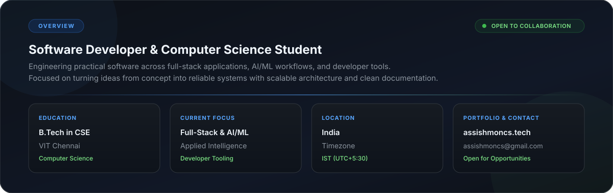
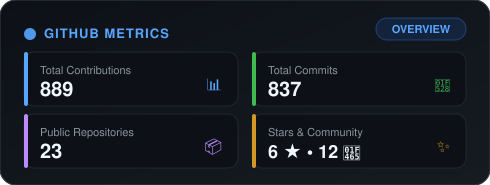
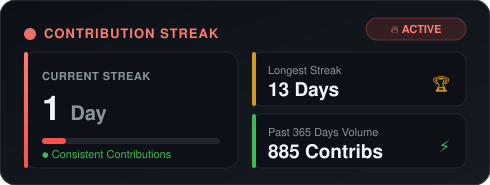
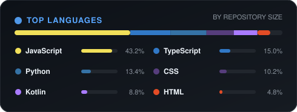
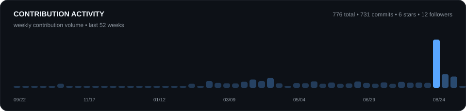

 

# 

  <em>Computer Science undergraduate passionate about full-stack engineering, distributed systems, and turning innovative ideas into robust software.</em>

  
  
  
  
  

  
  
  
  

---

## About Me

 

- **Education:** B.Tech in Computer Science & Engineering at **VIT Chennai**
- **Current Focus:** Full-Stack Architecture, AI/ML Integrations, and Developer Tooling
- **Building:** Real-time collaboration systems, peer-to-peer web delivery engines, and mobile digital wellbeing tools
- **Location:** Tamil Nadu, India (IST / UTC+5:30)
- **Get in Touch:** [assishmoncs@gmail.com](mailto:assishmoncs@gmail.com) • [LinkedIn](https://www.linkedin.com/in/assishmoncs/) • [assishmoncs.tech](https://assishmoncs.tech)
- **Fun Fact:** When not architecting systems, you'll find me solving algorithm challenges on [LeetCode](https://leetcode.com/u/assishmoncs/).

---

## Tech Stack

### Languages

  

### Frontend & Mobile

  

### Backend & Databases

  

### Tools & DevOps

  

---

## Featured Projects

<table width="100%">
<tr>
<td width="50%" valign="top">

### [PairPad](https://github.com/assishmoncs/pairpad)
Real-time collaborative code editor designed for pair programming, live interviews, and synchronized execution.

- **Stack:** `React` `Node.js` `Socket.IO` `MongoDB`
- **Features:** Real-time multi-cursor syncing, shared terminal, secure rooms

</td>
<td width="50%" valign="top">

### [Zentra](https://github.com/assishmoncs/zentra)
Native Android digital wellbeing application focused on attention tracking, focus sessions, and app analytics.

- **Stack:** `Kotlin` `Android Jetpack` `Room DB` `Hilt`
- **Features:** Focus score engine, background usage tracker, session timer

</td>
</tr>
<tr>
<td width="50%" valign="top">

### [AI Study Planner](https://github.com/assishmoncs/ai-study-planner)
Intelligent full-stack study management platform with schedule optimization and productivity insights.

- **Stack:** `Next.js` `TypeScript` `Node.js` `MongoDB`
- **Features:** Dynamic study session generation, task tracker, progress dashboards

</td>
<td width="50%" valign="top">

### [ShadowCast](https://github.com/assishmoncs/shadowcast)
Decentralized peer-to-peer web asset delivery engine leveraging browser-to-browser WebRTC channels.

- **Stack:** `TypeScript` `WebRTC` `Go` `Next.js`
- **Features:** Low-latency swarm data routing, bandwidth saving, P2P mesh

</td>
</tr>
</table>

---

## GitHub Analytics & Statistics

<!-- Local Offline-Reliable Automated Analytics Cards -->

  

---

## Contribution Activity

  

### Contribution Graph Snake

<picture>
  <source media="(prefers-color-scheme: dark)" srcset="https://raw.githubusercontent.com/assishmoncs/assishmoncs/output/github-contribution-grid-snake.svg" />
  <source media="(prefers-color-scheme: light)" srcset="https://raw.githubusercontent.com/assishmoncs/output/github-contribution-grid-snake.svg" />
  
</picture>

---

### Let's Connect & Collaborate

I am always open to discussing new projects, open-source contributions, or engineering opportunities.  
Reach out via [LinkedIn](https://www.linkedin.com/in/assishmoncs/) or drop an email at [assishmoncs@gmail.com](mailto:assishmoncs@gmail.com).

